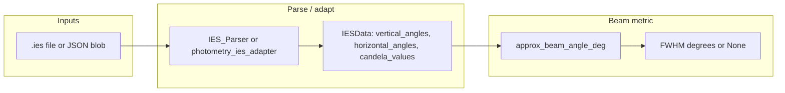

# Beam angle in LuxScale / `ies-render`

This note explains **how beam angle is defined in math**, **how LM-63 data is laid out in memory**, **where it is implemented in code**, and how **`ies-render`** uses it (the renderer **does not** re-derive beam angle internally).

---

## 1. Executive summary

| Item | Detail |
|------|--------|
| **Metric** | **FWHM** (full width at half maximum) in **degrees** |
| **Plane** | **Vertical** meridian: candela vs vertical angle at **one** horizontal angle |
| **That horizontal angle** | Always `horizontal_angles[0]` (first entry in the parsed list — file order) |
| **Intensity curve** | Candela values \(I_i\) at tabulated \(\gamma_i\) = `vertical_angles[i]` |
| **Half-power** | Points where \(I_i \ge \frac{1}{2}\max_j I_j\) |
| **Reported angle** | \(\lvert \gamma_{i_{\max}} - \gamma_{i_{\min}} \rvert\) over **indices** satisfying the inequality (see §2.5) |
| **Implementation** | `luxscale/ies_fixture_params.py` → `approx_beam_angle_deg()` |
| **IES parsing** | `ies-render/module/ies_parser.py` → `IESData` (no beam math there) |

---

## 2. LM-63 file → `IESData` (what the parser builds)

LuxScale uses the **IESNA LM-63** text photometry format (after `TILT=`). The parser (`IES_Parser._parse`) reads, in order:

1. **Header numbers** (13 values): lamp count, lumens, multiplier, **number of vertical angles**, **number of horizontal angles**, units, opening dimensions, etc.
2. **Vertical angles** — `num_vertical_angles` values (degrees).
3. **Horizontal angles** — `num_horizontal_angles` values (degrees).
4. **Candela block** — `num_vertical_angles × num_horizontal_angles` values, in **file order**.

### 2.1 How the flat candela list becomes a 2D grid

Let \(V =\) `len(vertical_angles)` and \(H =\) `len(horizontal_angles)`.

The file stores candela in a long list; the parser reshapes it so that **for each horizontal angle** \(h_j\) there is a **vector of length \(V\)** along vertical angles:

```text
candela_values[h_j][i]  ≈  intensity in direction (horizontal = h_j, vertical = γ_i)
```

Code (`ies_parser.py`): with `V = len(candela_values) // len(horizontal_angles)`,

```python
candela_values_dct = {
    n: candela_values[i * V : (i + 1) * V]
    for i, n in enumerate(horizontal_angles)
}
```

Keys `n` are the **actual** horizontal angle floats (e.g. `0.0`, `22.5`, …). The **first** horizontal in **list order** is `horizontal_angles[0]`; that is the slice used for beam angle.

### 2.2 `IESData` namedtuple (relevant fields)

From `ies_parser.py`:

| Field | Meaning |
|-------|---------|
| `vertical_angles` | List \(\gamma_0 \ldots \gamma_{V-1}\) (degrees) |
| `horizontal_angles` | List of \(H\) horizontal angles (degrees) |
| `candela_values` | `dict[float, list[float]]`: key = horizontal angle, value = length-\(V\) candela row |
| `max_value` | Global max candela in file (not used by `approx_beam_angle_deg`, which recomputes max on the slice) |

### 2.3 Validation rules in the parser (strict subset)

The stock parser **raises** `BrokenIESFileError` unless vertical angles start/end in allowed ranges (e.g. first vertical in `{0, 90, -90}`, last in `{90, 180}`, etc.) and horizontal ends in `{0, 90, 180, 360}`. Files outside that subset may fail to parse here even if other tools accept them.

### 2.4 Same numbers from JSON blobs (`photometry_ies_adapter`)

When a fixture has a precomputed **`ies.json` / photometry blob**, `luxscale/photometry_ies_adapter.py` builds an **`IESData`** compatible structure: `horizontal_angles_deg`, `vertical_angles_deg`, and `candela_by_horizontal_deg` are converted into the same `candela_values[float] -> list` shape. **`approx_beam_angle_deg` is identical** whether data came from raw `.ies` or from the blob.

---

## 3. Mathematical definition (FWHM on one vertical slice)

### 3.1 Symbols

- \(\alpha_0 =\) `horizontal_angles[0]` (degrees).
- \(\gamma_i =\) `vertical_angles[i]`, \(i = 0 \ldots V-1\).
- \(I_i =\) candela at \((\alpha_0, \gamma_i)\), i.e. `candela_values[α₀][i]` (with float key matching).

### 3.2 Peak and half level

\[
I_{\max} = \max_{i} I_i, \qquad
I_{\mathrm{half}} = \tfrac{1}{2} I_{\max}.
\]

If \(I_{\max} \le 0\) or \(V < 2\), the function returns **`None`**.

### 3.3 Index set above half maximum

\[
\mathcal{S} = \{\, i \in \{0,\ldots,V-1\} \mid I_i \ge I_{\mathrm{half}} \,\}.
\]

If \(\mathcal{S}\) is empty → **`None`**.

### 3.4 FWHM angle reported in code

Let \(i_{\min} = \min \mathcal{S}\) and \(i_{\max} = \max \mathcal{S}\) (min/max **index**, not min/max angle).

\[
\boxed{
\theta_{\mathrm{beam}} = \bigl\lvert \gamma_{i_{\max}} - \gamma_{i_{\min}}} \bigr\rvert
}
\]

So the result is the **difference between the vertical angles** at the **extreme indices** that still satisfy \(I \ge I_{\max}/2\), **not** an interpolation to exact half-power crossings between samples.

### 3.5 Relation to “classical” FWHM

Classical FWHM often finds two **angles** \(\gamma_L, \gamma_R\) where the **continuous** curve crosses \(I_{\max}/2\), possibly with **linear interpolation** between samples. LuxScale uses the **discrete** rule above: outermost **tabulated** vertical angles whose candela is still \(\ge\) half peak. That tends to **slightly overestimate** the classical FWHM when the grid is coarse, and it requires **no interpolation** implementation.

### 3.6 Multimodal / gap artifacts

- If the vertical slice has **two separated bright lobes**, \(\mathcal{S}\) can be **non-contiguous** in \(i\). Then \(i_{\min}\) and \(i_{\max}\) span **both** lobes → the returned angle can be **very large** (physically misleading). The code does **not** restrict to the connected component around the global maximum.
- For typical **single-lobe** beams, \(\mathcal{S}\) is usually one contiguous band of indices → behavior matches intuition.

### 3.7 Why `horizontal_angles[0]` only

- **Implementation choice:** one cheap, reproducible number for catalog + UI.
- Many **Type C** floods in the repo use horizontal symmetry; the first H is often **0°** (photometric axis). If your product sheet quotes beam in another **azimuth**, this scalar may **not** match without changing the code to select a different H (e.g. max-candela H).

---

## 4. Worked example (toy numbers)

Suppose at \(\alpha_0 = 0°\):

| \(i\) | 0 | 1 | 2 | 3 | 4 |
|-------|---|---|---|---|---|
| \(\gamma_i\) (°) | 0 | 15 | 30 | 45 | 60 |
| \(I_i\) (cd) | 100 | 800 | **1200** | 800 | 100 |

Then \(I_{\max} = 1200\), \(I_{\mathrm{half}} = 600\).

Indices with \(I_i \ge 600\): \(i \in \{1,2,3\}\) → \(i_{\min}=1\), \(i_{\max}=3\).

\[
\theta_{\mathrm{beam}} = |\gamma_3 - \gamma_1| = |45° - 15°| = 30°.
\]

If half-power fell **between** 15° and 30°, a continuous FWHM might be slightly **less** than 30°; LuxScale would still report **30°** until a sample drops below 600.

---

## 5. Comparison to CIE / datasheet language (informative)

CIE publications (e.g. cone metrics, **beam** vs **field** angle) often define angles from **percent of peak** or **percent of flux** in a plane or cone — **not** identical to “FWHM on one LM-63 vertical slice at H=first”.

Manufacturer PDFs may quote:

- Half beam / beam angle from **cone** photometry,
- **Field** angle at 10% of peak,
- Or photometric **type B** planes.

Treat **`approx_beam_angle_deg`** as a **consistent internal LuxScale metric** aligned with the stored LM-63 grid, not a guaranteed match to every datasheet line.

---

## 6. Code paths (exact)

### 6.1 `approx_beam_angle_deg` — source of truth

**File:** `luxscale/ies_fixture_params.py`

```python
def approx_beam_angle_deg(ies_data) -> Optional[float]:
    try:
        ha = ies_data.horizontal_angles[0]
        vals = np.asarray(ies_data.candela_values[ha], dtype=float)
        va = np.asarray(ies_data.vertical_angles, dtype=float)
        peak = float(np.max(vals))
        if peak <= 0 or va.size < 2:
            return None
        half = peak * 0.5
        mask = vals >= half
        if not np.any(mask):
            return None
        idx = np.where(mask)[0]
        return float(abs(va[idx[-1]] - va[idx[0]]))
    except Exception:
        return None
```

**Note:** `candela_values[ha]` uses `ha` as dict key; `IES_Parser` keys are floats from `enumerate(horizontal_angles)`. If a blob used string keys in JSON, the adapter normalizes to `float` keys.

### 6.2 Loading order: blob vs file

`_load_ies_data_cached` in the same file tries **`photometry_ies_adapter.try_load_ies_data_via_catalog`** first, then **`IES_Parser(path).ies_data`**. Beam angle is computed on whichever **`IESData`** is returned.

### 6.3 Downstream consumers

| Consumer | Use |
|----------|-----|
| `ies_params_for_file()` | Returns `beam_angle_deg` for lighting calc |
| `luxscale/ies_json_builder.py` | Writes e.g. `beam_angle_deg_half_power_vertical_slice` into derived metadata |
| Lighting calculator | Displays “Beam Angle” when IES meta present (`calculate.py`) |

### 6.4 `ies-render` UI (display only)

| File | Behavior |
|------|----------|
| `ies-render/module/ies_viewer.py` | `_beam_angle_caption()` calls `approx_beam_angle_deg` for a label |
| `ies-render/run.py` | Prints beam if `luxscale` import works |

### 6.5 Not beam angle: viewer “Horizontal Angle” control

In **`ies_viewer`**, the **Horizontal Angle** spinbox selects which **azimuth** is used to **render** the polar/wall image (`_ies_render_strategy.py`). That is **independent** of which horizontal slice is used for **`approx_beam_angle_deg`** (always first H in file). You can show a beautiful render at H=45° while the reported FWHM remains at **`horizontal_angles[0]`**.

---

## 7. What the renderer computes (orthogonal concern)

`ies-render/module/_ies_render_strategy.py` and `ies_gen.py` compute **pixel sampling**: directions on a wall, interpolation of candela over the grid, etc. They **do not** output the scalar FWHM beam angle; they only need the same `IESData` grid.

---

## 8. Flow (data to number)



---

## 9. Failure modes (`None`)

| Condition | Result |
|-----------|--------|
| `max(vals) <= 0` | `None` |
| Fewer than 2 vertical samples | `None` |
| No sample \(\ge I_{\max}/2\) | `None` |
| Exception (missing key, length mismatch, etc.) | `None` (swallowed) |

---

## 10. Quick reference card

| Quantity | Meaning |
|----------|---------|
| Slice | Vertical candela vs vertical angle at **first** horizontal angle in `horizontal_angles` |
| Metric | Angular separation between **tabulated** \(\gamma\) at outermost indices still \(\ge\) half peak candela |
| Units | Degrees |
| Interpolation | **None** (discrete FWHM band on the grid) |

---

## 11. Related files (index)

| Path | Role |
|------|------|
| `luxscale/ies_fixture_params.py` | `approx_beam_angle_deg`, `ies_params_for_file`, parser loader |
| `luxscale/photometry_ies_adapter.py` | Build `IESData` from catalog JSON blob |
| `luxscale/ies_json_builder.py` | Export `beam_angle_deg_half_power_vertical_slice` |
| `ies-render/module/ies_parser.py` | LM-63 parse → `IESData` |
| `ies-render/module/ies_viewer.py` | Show FWHM caption |
| `ies-render/run.py` | CLI print |
