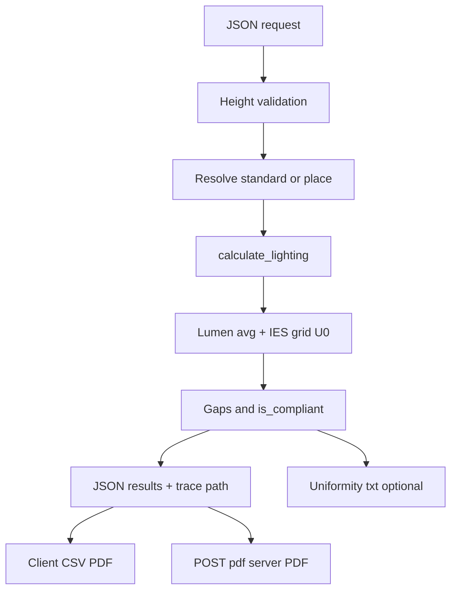

# Pipeline: from request to results, compare, check, export

This section orders **what happens numerically and structurally** from user input to downloadable outputs. Code references: **`app.py`**, **`luxscale/lighting_calc/calculate.py`**, **`luxscale/uniformity_calculator.py`**.

---

## Phase A — HTTP `POST /calculate` (JSON)

### Step A1 — Parse body

- Require **`sides`** (4 numbers) and **`height`**.
- Optional: **`project_info`**, **`standard_ref_no`**, **`fast`**.

### Step A2 — Validate ceiling height

\[
h \in [h_\mathrm{min,int}, H_\mathrm{th}) \quad \text{or} \quad h \in [H_\mathrm{th}, h_\mathrm{ext,max}]
\]

(see **`validate_ceiling_height_m`**). **Failure → 400**, no calculation.

### Step A3 — Resolve lighting target

- If **`standard_ref_no`** resolves in **`standards_cleaned.json`** → **`standard_row`** with \(E_{m,r}, U_{0,\mathrm{req}}\).
- Else require legacy **`place`** → **`define_places`**.

**Failure** if neither valid.

### Step A4 — Run **`calculate_lighting`**

- Geometry: \(A, L, W\), zone (interior/exterior), **`uniformity_grid_n_for_room`** → \(G\).
- Nested loops: luminaire families → power → efficacy → **fixture count** from \(N_\mathrm{min}\) upward.
- For each candidate: **spacing** → if **min spacing** OK and **not** over **1.35 × \(E_{m,r}\)** on average → **IES grid** → compute **\(U_0\)** → fill **Lux gap**, **U0 gap**, **`is_compliant`**.
- **Stop** early when enough **compliant** rows (**`max_solutions_total`**).
- If **no** compliant row: **closest** candidates → optional **`_uniformity_fallback_sweep_rows`** (relaxed average cap **1.65 × \(E_{m,r}\)**).

### Step A5 — Response JSON

- **`results`**: array of option dicts (luminaire, power, spacing, **Average Lux**, **U0_calculated**, gaps, margins, IES fields, etc.).
- **`length`**, **`width`**, **`calculation_meta`**, **`ui_settings`**, **`standard_row`** (if used).
- **`calculation_trace_file`**: path to human-readable trace (**`CalculationTrace`**).

---

## Phase B — Compare and check (client-side)

The API **already** embeds **`is_compliant`**, **Lux gap**, **U0 gap**. The results page can:

- **Sort / filter** by compliant flag.
- **Compare** options by **Total Power**, **Fixtures**, **U0_calculated**, **Average Lux**.

No extra server round-trip is required for basic comparison.

---

## Phase C — Uniformity text report (server-side file)

After **`calculate_lighting`**, **`write_uniformity_session_txt`** may write **`uniformity_reports/uniformity_calc_YYYYMMDD_HHMMSS.txt`** containing per-option **E_min**, **E_avg**, **E_max**, **U0**, **U1**, and the illuminance matrix.

---

## Phase D — Export paths

### D1 — **`POST /pdf`** (Flask)

Re-runs **`calculate_lighting`** with the same inputs, builds **FPDF** rows (**key: value** per line per option), returns **`report.pdf`**.

### D2 — **Browser CSV** (`result.html` / `online-result.html`)

Client builds CSV from **`results`** objects (quoted fields, headers from known keys). **No separate equation** — lossless table of numbers already in JSON.

### D3 — **Browser PDF** (PDF-lib)

Client draws project + customer + selected **results** rows into a PDF. Same data as JSON.

### D4 — **DXF / STL** (where enabled on `result.html`)

Exports **layout geometry** (positions, room box) — **not** lux physics; coordinates match the 3D layout mapping.

### D5 — **Tk `export_io.py`** (desktop GUI)

CSV/PDF from **`results`** + **`project_info`** — same numeric fields.

---

## Phase E — Heatmap image (optional)

**`draw_heatmap`** (API or tools): **not** used inside **`calculate_lighting`**. It bins **fixture centres** on a 100×100 grid — **not** physical **E** (see [../lighting/12-supporting-modules-catalog-and-settings.md](../lighting/12-supporting-modules-catalog-and-settings.md)).

---

## Summary diagram

---

Next: [05-ies-lm63-fields-beam-angle-and-flux.md](./05-ies-lm63-fields-beam-angle-and-flux.md)
